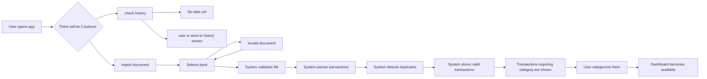

# Flow 1 First time user

```mermaid
flowchart LR
    A[User opens app] --> B{There will be 2 buttons:} 
    B{There will be 2 buttons:} --> C[check history] --> CD[No data yet]
    C[check history] --> CE[user is send to history screen]
    B --> F[Import document] --> G[Selects bank]
    G --> H[Invalid document] -->G
    G --> I[System validates file]
    I --> J[System parses transactions]
    J --> K[System detects duplicates]
    K --> L[System stores valid transactions]
    L --> M[Transactions requiring category are shown]
    M --> N[User categorizes them]
    N --> O[Dashboard becomes available]

```